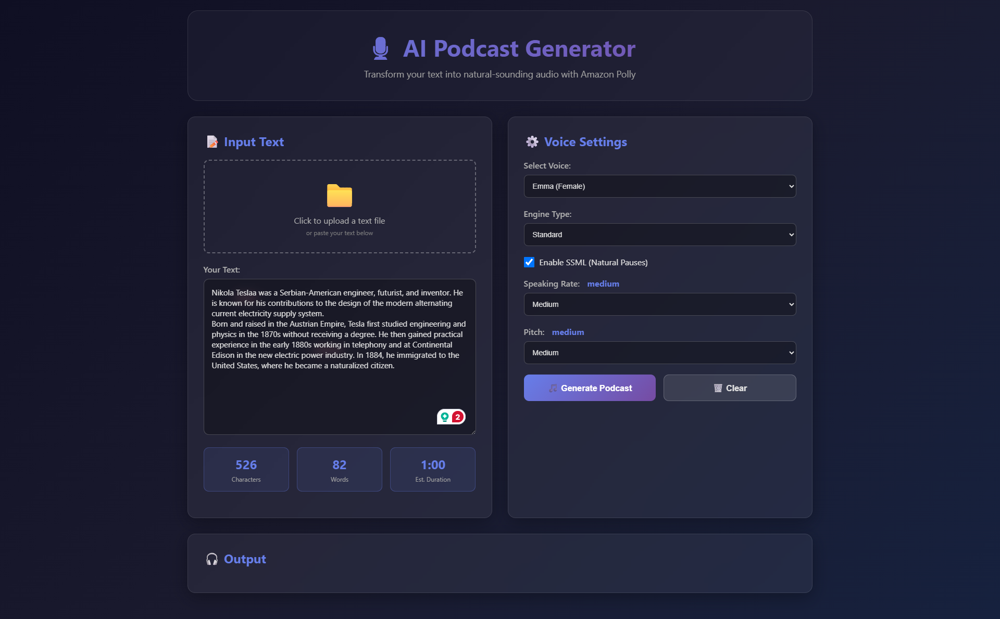
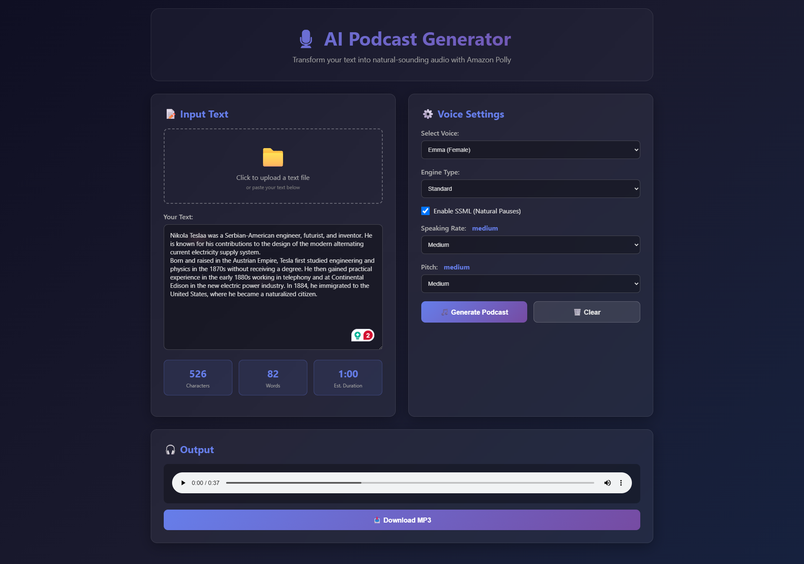
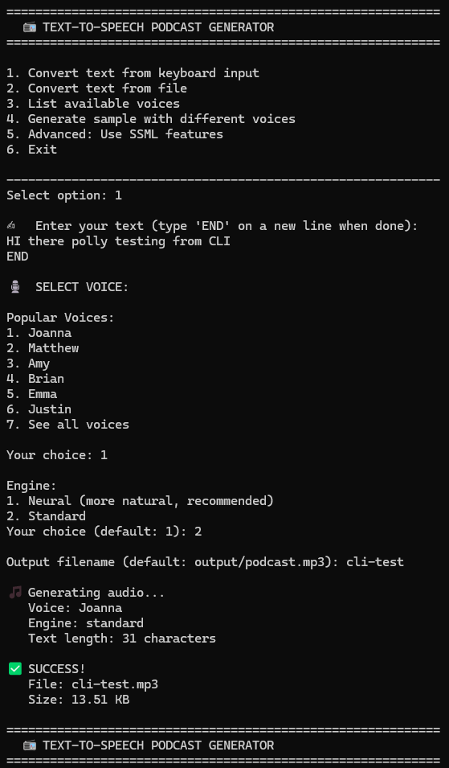

# Text-to-Speech with AWS Polly

This project provides two ways to convert text to speech using AWS Polly:

- A web interface (Flask + `app.py` + `templates/index.html`) to paste or upload text and download generated MP3 files.
- A command-line interface (`podcast_cli.py`) for interactive conversion from keyboard input or files.

Both approaches use `boto3` to call AWS Polly. Generated audio files are saved to the `output/` folder.

## Demo
**Web Demo:**

 

**CLI Demo:**



## Prerequisites

- Python 3.8+ installed
- An AWS account with permissions to use Amazon Polly
- `pip` for installing Python dependencies

## Setup (recommended)

1. Create and activate a virtual environment:

   Windows PowerShell:

   ```powershell
   python -m venv .venv
   .\.venv\Scripts\Activate.ps1
   ```

2. Install dependencies:

   ```powershell
   pip install -r requirements.txt
   ```

3. Provide AWS credentials. The project uses `python-dotenv` to load environment variables from a `.env` file in the project root. Create a `.env` file containing:

   ```ini
   AWS_ACCESS_KEY_ID=YOUR_AWS_ACCESS_KEY_ID
   AWS_SECRET_ACCESS_KEY=YOUR_AWS_SECRET_ACCESS_KEY
   AWS_REGION=us-east-1
   ```

   Replace values with your AWS credentials. Alternatively, you can rely on other AWS credential methods (`AWS_PROFILE`, shared credentials file, or environment variables) supported by `boto3`.

## Notes about limits

- Neural engine limit: ~3000 characters per request
- Standard engine limit: ~6000 characters per request

If your text exceeds the engine limit, split it into smaller chunks before sending to Polly.

## Web UI (Flask)

1. Ensure your `.env` is present (or AWS credentials are otherwise available).
2. Run the Flask app:

   ```powershell
   python app.py
   ```

3. Open a browser and visit:

   http://localhost:5000

4. Use the UI to paste text, upload a text file, choose voice/engine/SSML options, and generate an MP3. Generated files are saved to `output/` and can be downloaded via the UI.

## CLI (`podcast_cli.py`)

1. Ensure your `.env` is present (or credentials available to `boto3`).
2. Run the CLI tool:

   ```powershell
   python podcast_cli.py
   ```

3. Follow the interactive menu to convert text typed in, convert from a file, list available voices, or generate sample audio files. Output files are written under the `output/` directory by default.

## Output folders

- `output/` - generated MP3 files
- `uploads/` - (used by the web UI) for uploaded text files

Both folders are created automatically by the application.

## Troubleshooting

- Permission/credentials errors: ensure AWS keys are correct and have Polly permissions (polly:SynthesizeSpeech, polly:DescribeVoices).
- Network errors: ensure outbound network access to AWS endpoints.
- If you get unexpected errors from `boto3`/`botocore`, upgrade dependencies or test with the AWS CLI to validate credentials.

## Security

Do not commit your `.env` file or credentials to source control. Use IAM roles or secure secrets management for production deployments.

## Acknowledgements

Built with Flask, Boto3 and AWS Polly.
